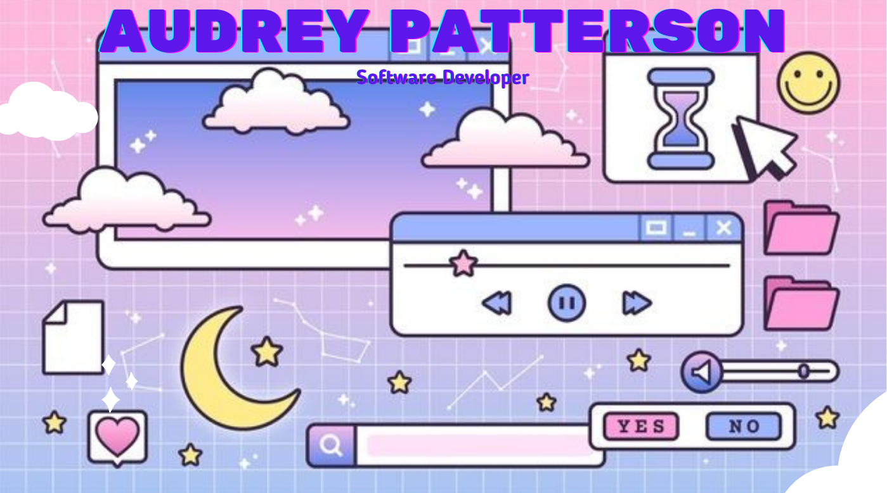

## < Hey there, hey! />

I'm Audrey! I'm a Software Developer based in Seattle, WA. I'm experienced in JavaScript, React, React Native, and Node.js. I have over ten years of experience in software training and implementation. I love that technology is constantly changing because it allows me to keep my mind active as I continue to learn new things. I made the jump into software development by learning through free courses and then finally completing a six month coding bootcamp. If I can make a positive impact on the world through the projects I work on or create, then moving into this industry has been worth it.

Aside from software development, I enjoy spending time with my daughter and two chonky kitties. I love creating art, collecting art in the form of tattoos, and geeking out over the hottest celebrity gossip!

👩🏾‍🏫 I’m currently learning:
  - TypeScript
  - iOS & Swift

I love making new connections so please reach out to me on the following social accounts.

### 💻 🛠️ Tech and Tools

###  GitHub Stats

### 💖 Thanks for stopping by! 💖

### Shout-out Resources

- [GitHub HR Profile](https://githubprofile.com/)

<!--
**arpatterson31/arpatterson31** is a ✨ _special_ ✨ repository because its `README.md` (this file) appears on your GitHub profile.

Here are some ideas to get you started:

- 🔭 I’m currently working on ...
- 🌱 I’m currently learning ...
- 👯 I’m looking to collaborate on ...
- 🤔 I’m looking for help with ...
- 💬 Ask me about ...
- 📫 How to reach me: ...
- 😄 Pronouns: ...
- ⚡ Fun fact: ...
-->
